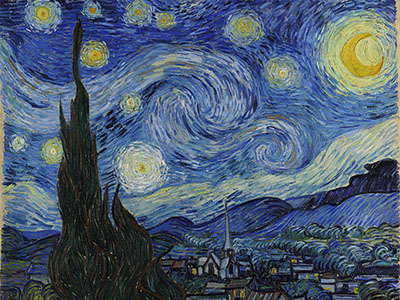
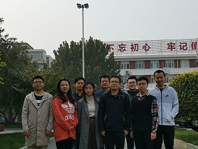
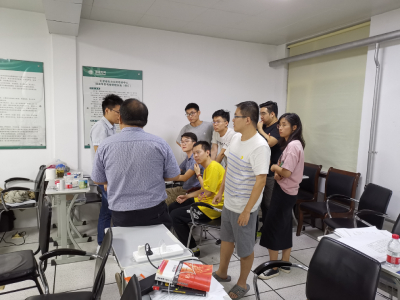
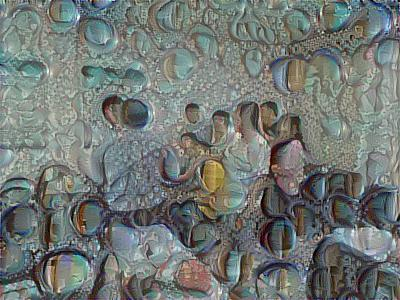

<!DOCTYPE html>
<html>
<body>
<h1>神经风格迁移</h1>
<h2>效果展示</h2>
<table align="center">
    <caption>风格迁移图片展示</caption>
    <tr>
        <th>原图</th>
        <th>迁移风格</th>
        <th>效果图</th>
    </tr>
    <tr>
        <td>
            
        </td>
        <td>
            
        </td>
        <td>
            
        </td>
    </tr>
        <tr>
        <td>
            
        </td>
        <td>
            
        </td>
        <td>
            
        </td>
    </tr>
        <tr>
        <td>
            
        </td>
        <td>
            
        </td>
        <td>
            
        </td>
    </tr>
</table>
<h2>使用方法</h2>
<ul>
    <li>分别在./pictures/下和./pictures/generated_pictures下创建文件夹，命名自定义</li>
    <li>将原图命名为content.jpg置入到./pictures/的自定义文件夹下，手动调整大小为600×400(也可使用代码调整)，重命名为content_reshape.jpg</li>
    <li>将原图命名为style.jpg置入到./pictures/的自定义文件夹下，手动调整大小为600×400(也可使用代码调整)，重命名为style_reshape.jpg</li>
    <li>在main.py中设置迭代次数，然后enjoy it</li>    
</ul>
<h2>运行环境</h2>

本项目基于python3.6编写，所用到的第三方库如requirements.txt所示，然后运行以下代码

<code>pip install -r requirements.txt</code>
</body>
</html>